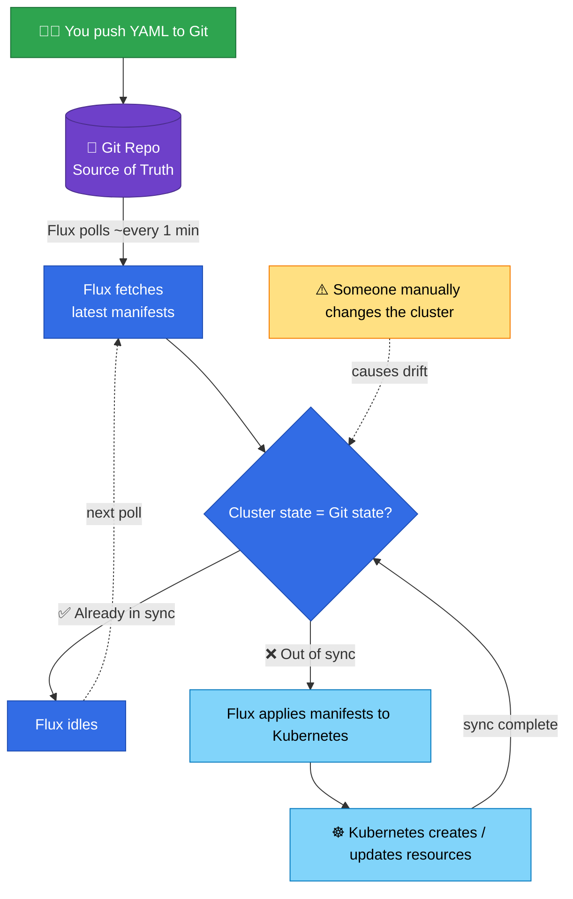

```bash
,     ,.  ,-.    |   ,--. .  .  ,-.  ,-.  ,---. ,-.   ,-.  .   ,   |   ,    , .   , ,--.
|    /  \ |  )   |   |    |\ | /    (   `   |   |  ) /   \ |\ /|   |   |    | |  /  |
|    |--| |-<    |   |-   | \| | -.  `-.    |   |-<  |   | | V |   |   |    | | /   |-
|    |  | |  )   |   |    |  | \  | .   )   |   |  \ \   / |   |   |   |    | |/    |
`--' '  ' `-'    |   `--' '  '  `-'  `-'    '   '  '  `-'  '   '   |   `--' ' '     `--'

```

##  Welcome

Welcome to my Home Lab repository — the digital scrapbook of my questionable life choices involving Kubernetes, Proxmox, OPNsense, and Cisco gear that probably belongs in a small business rather than my house.

This repo is the source of truth for my Talos‑powered Kubernetes cluster running on a Proxmox virtualization stack, all glued together with VLANs, YAML, and sheer stubbornness.

My mission?
Learn modern infrastructure, automate everything, break things in creative ways, and pretend I know what I’m doing.

---
##  Hardware

| System     | Role                | CPU                | RAM  | Graphics                         | Disk (boot)    | Disk (storage)              |
|------------|---------------------|--------------------|------|----------------------------------|----------------|-----------------------------|
| px-node01  | Proxmox Node        | 1× Xeon E5-2697 v2 | 32GiB | Nvidia Quadro T400              | Kingston 120GB | 2× PNY 1TB                  |
| px-node02  | Proxmox Node        | 2× Xeon E5-2690 v2 | 32GiB | -                               | Kingston 120GB | PNY 1TB, Kingston 1TB       |
| px-node03  | Proxmox Node        | 2× Xeon E5504      | 32GiB | -                               | Kingston 120GB | PNY 1TB, Kingston 1TB       |
| px-node04  | Proxmox Node        | 1× Xeon E5-2683 v4 | 48GiB | Nvidia Quadro P2000, Tesla K80  | WDC 120GB      | PNY 1TB, Kingston 1TB       |
| srv-talos01 running on px-node01| k3s Control Plane + Worker  | 4 vCPU             | 8GiB | -                               | vg_system 80GB | vg_storage 700GB            |
| srv-talos02 running on px-node02| k3s Control Plane + Worker  | 4 vCPU             | 8GiB | -                               | vg_system 80GB | vg_storage 700GB            |
| srv-talos03 running on px-node03| k3s Control Plane + Worker  | 4 vCPU             | 8GiB | -                               | vg_system 80GB | vg_storage 700GB            |
| srv-talos04 running on px-node04| k3s Control Plane + Worker  | 4 vCPU             | 8GiB | -                               | vg_system 80GB | vg_storage 700GB            |

Everything is wired into a Cisco network with VLANs for IoT, Management, LAN, Servers, and Cameras — because nothing says “home” like enterprise‑grade segmentation.

All routing and firewalling is handled by OPNsense, which I lovingly refer to as “the box that decides whether packets deserve to live.”

---
##  Talos Linux

[Talos](https://www.talos.dev) is an immutable, API‑driven operating system designed specifically for Kubernetes.

No SSH.
No package manager.
No “just quickly logging in to fix something.”

Talos forces me to behave like a responsible adult and manage everything declaratively.
It’s GitOps‑friendly, predictable, and occasionally terrifying — in a good way.

---

##  Kubernetes

This home lab is my personal dojo for learning Kubernetes.
I wanted a place where I could experiment, scale, break things safely, and eventually run useful self‑hosted apps for myself and my family.

Kubernetes gives me:

- a playground

- a production‑ish environment

- and a reason to explain to guests why the lights flicker when I reboot a node

---

##  Networking: Cilium

Networking inside the cluster is powered by [Cilium](https://cilium.io/), because if I’m going to confuse myself with networking, I might as well use eBPF while I’m at it.

Cilium gives me fast, modern networking and enough observability tools to feel like I’m running a small cloud provider.

---

##  GitOps with Flux

The backbone of this entire setup is [Flux CD](https://fluxcd.io/) — the GitOps controller that ensures my cluster always matches what’s in Git.

Flux is like a very strict librarian:

- It sees everything

- It remembers everything

- It puts everything back where it belongs

- And it gets annoyed when I touch things manually

Together with [Renovate](https://www.mend.io/renovate/), most updates happen automatically — sometimes faster than I can read the release notes.

### How it works

Flux continuously compares the cluster state with Git.
If something drifts, Flux fixes it.
If I break something, Flux fixes it.
If I think about making a manual change, Flux senses it and prepares to fix it.

<details>
  <summary>See Flux in action</summary>



> **GitOps magic:** The cluster always converges back to Git — even if I don’t.

</details>

---
##  Foundation: onedr0p's Cluster Template

Massive thanks to [onedr0p/cluster-template](https://github.com/onedr0p/cluster-template).
It gave me a clean, modern foundation for Talos + Flux and taught me how to structure manifests, use SOPS, and avoid turning my repo into a YAML graveyard.

[](https://github.com/onedr0p/cluster-template)
[](https://github.com/onedr0p/cluster-template)


---
##  Start This Journey Today
If you’re even remotely curious about home labs, build one.
It doesn’t have to be Kubernetes.
It doesn’t have to be fancy.
It doesn’t even have to make sense.

Grab an old computer, install something, and see where the rabbit hole leads.

You’ll learn a ton.
You’ll break things.
You’ll fix things.
And eventually, you’ll end up explaining to your family why the TV stopped working because you “accidentally deleted the wrong VLAN.”

---

##  Stargazers

## Star History

<a href="https://www.star-history.com/?repos=3nm1%2Fhome-ops&type=date&legend=top-left">
 <picture>
   <source media="(prefers-color-scheme: dark)" srcset="https://api.star-history.com/chart?repos=3nm1/home-ops&type=date&theme=dark&legend=top-left" />
   <source media="(prefers-color-scheme: light)" srcset="https://api.star-history.com/chart?repos=3nm1/home-ops&type=date&legend=top-left" />
   
 </picture>
</a>
